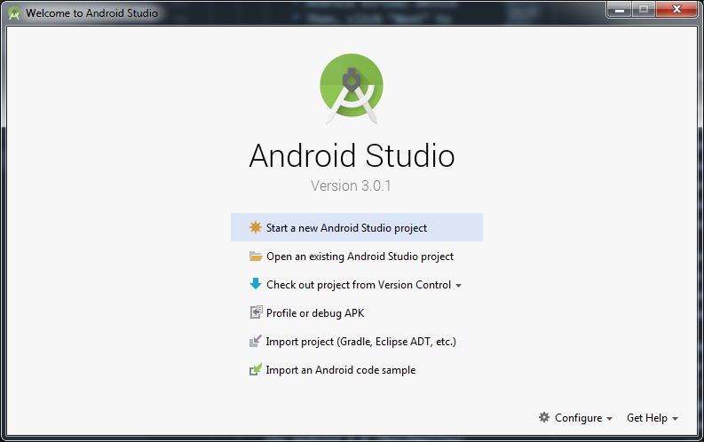
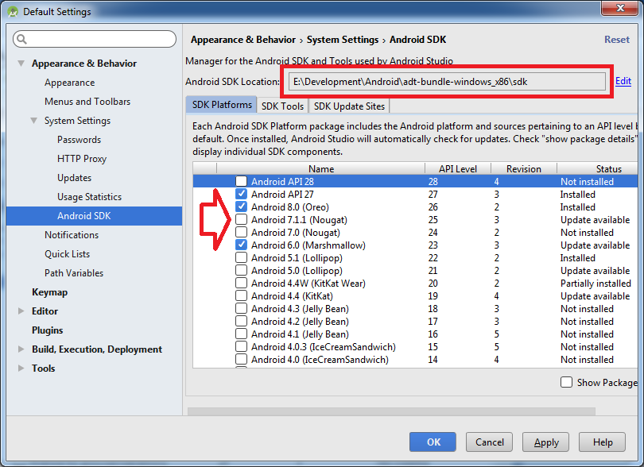
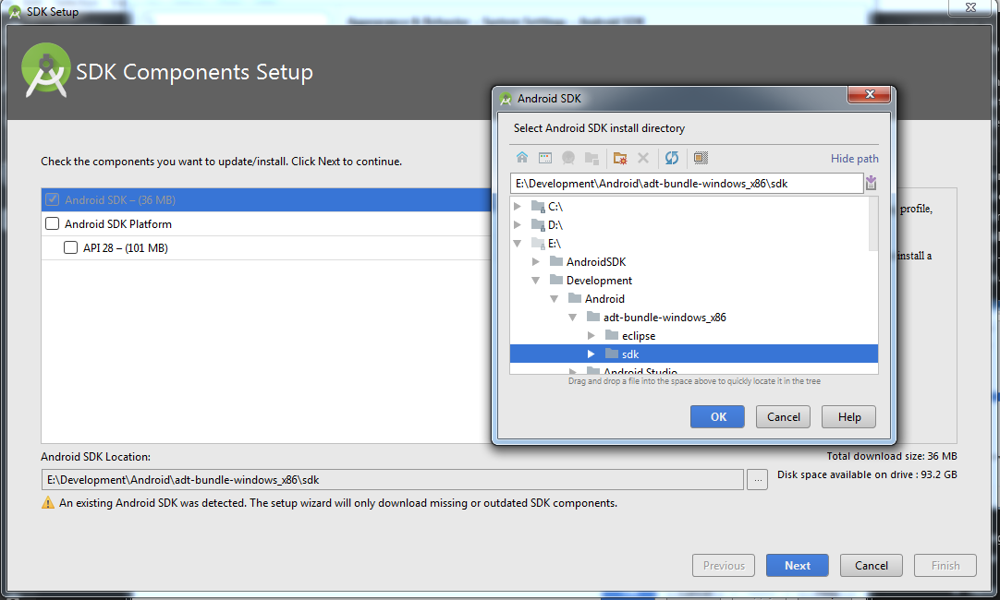
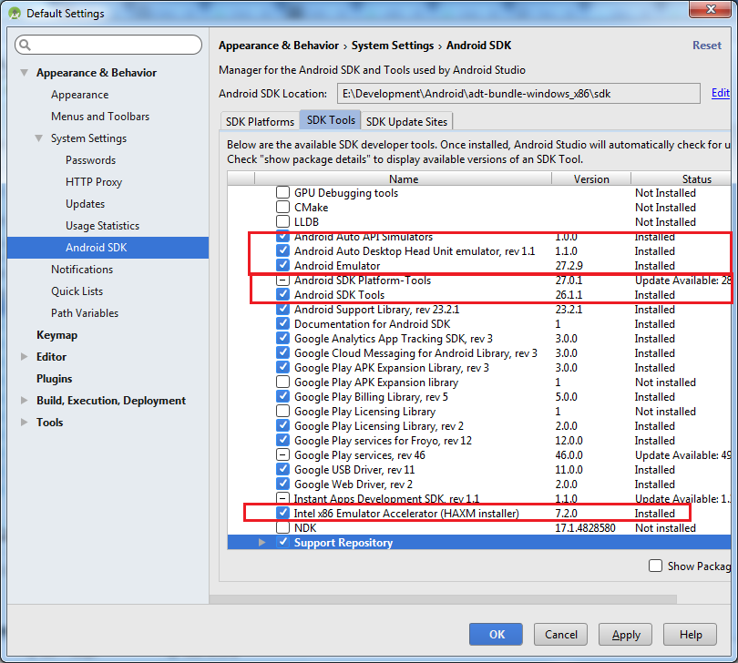
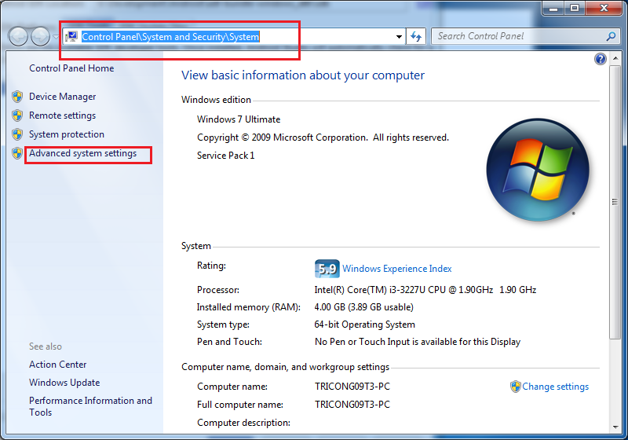
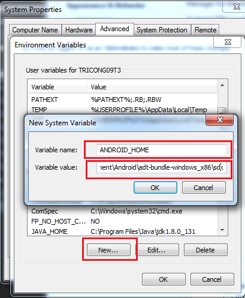
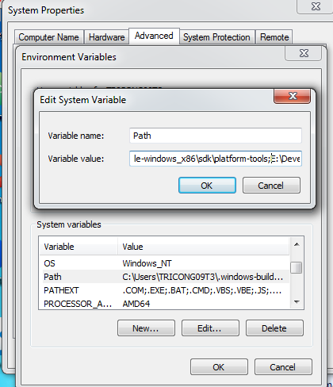

# react-native-trainning

## :arrow_up: Setup on WINDOW
1. Run cmd as administrator permission
2. Copy the below command to cmd and press ENTER
    > @"%SystemRoot%\System32\WindowsPowerShell\v1.0\powershell.exe" -NoProfile -InputFormat None -ExecutionPolicy Bypass -Command "iex ((New-Object System.Net.WebClient).DownloadString('https://chocolatey.org/install.ps1'))" && SET "PATH=%PATH%;%ALLUSERSPROFILE%\chocolatey\bin"

3. Turn off cmd & open again as administrator permission
4. Install JDK 8, Python2, Nodejs by the script
    > choco install -y nodejs.install python2 jdk8

5. Restart your computer & open cmd again (should be in administrator permission)
    > Tips: Yarn is a support tool for running the scripts like npm but  it is convenient in installing node_modules for  react native. 
    * Open cmd => copy the below script and press ENTER
    > choco install yarn
6. Install cli with script (this is for generating, linking your react native project later) 
    > npm install -g react-native-cli

7. Android & support tools
    * Install Android Studio
        * Download and install Android Studio (https://developer.android.com/studio/). Choose a "Custom" setup when prompted to select an installation type. Make sure the boxes next to all of the following are checked:
            * Android SDK
            * Android SDK Platform
            * Performance (Intel ® HAXM)
            * Android Virtual Device
            * Then, click "Next" to install all of these components.

    * Install Android SDK
        * Android Studio installs the latest Android SDK by default. Building a React Native app with native code, however, requires the Android 6.0 (Marshmallow) SDK

        * After installing android studio => Open androidStudio => You will see a screen like this:        
        

        * Click the "Configure" label at the right bottom => click "SDK manager"

             > The SDK Manager can also be found within the Android Studio File → Setttings →  Appearance & Behavior → System Settings → Android SDK.

        * Important: We should change the sdk location to your data disk - Not operating system disk (default is C disk) - Incase we install OS again => lost all sdk manager data -> time-consuming to download again.

        

        * Change your sdk path by click "Edit" => You will have a screen like this => next => next & finish

        

        * Next, select the "SDK Tools" tab and check the box next to "Show Package Details" here as well. Look for and expand the "Android SDK Build-Tools" entry, then make sure that 23.0.1, 26.0.2, 27.0.3 is selected.

        

        * DON'T PRESS "OK" -> click the second tab "SDK Tool" => See the picture - must tick these items (Also tick Support lib, license, HAMX, google play service as well)

        

        * Finally, click "OK" to download and install the Android SDK and related build tools.

    * Config ANDROD_HOME path -  environment variable
        * The React Native tools require some environment variables to be set up in order to build apps with native code.

        * Open the System pane under System and Security in the Windows Control Panel, then click on Change settings.... Open the Advanced tab and click on Environment Variables.... Click on New... to create a new ANDROID_HOME user variable that points to the path to your Android SDK:

        

        

    * Config ADB in system path
        * The same as setting ANDROID_HOME. Try to find "path" item in the system path => click on it then add your adb path like this (don't miss ';' before your path)
        >E:\Development\Android\adt-bundle-windows_x86\sdk\platform-tools;

        

    * Restart your computer as well and check again in your command line by typing
    > adb

8. Connect & run on devices 
    * Enable debug mode and run debug: read more https://facebook.github.io/react-native/docs/running-on-device.html

    * If you want to build and run on device with release mode, you must sign apk by defining keystore. Read more here https://facebook.github.io/react-native/docs/signed-apk-android.html