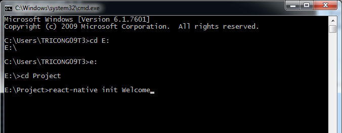
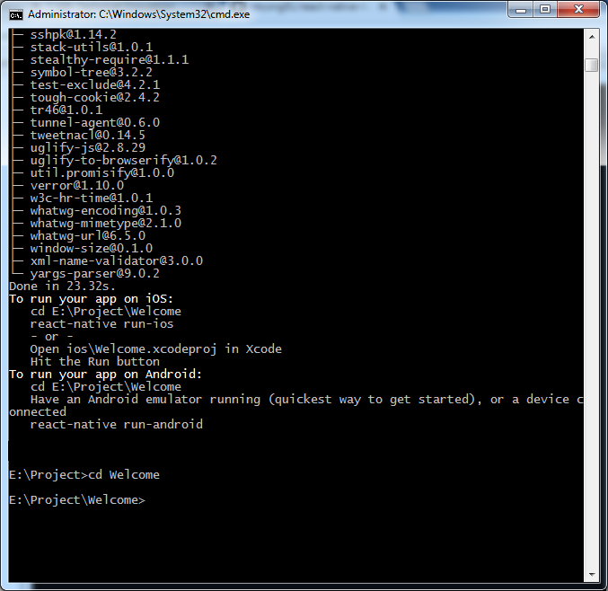
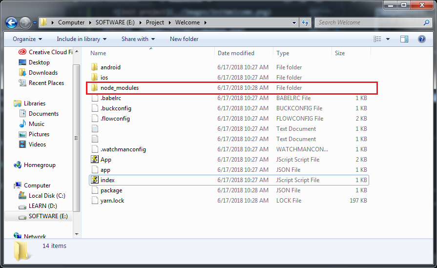

## :arrow_up: Creating a new application

1. Open command line cmd
2. Go to your project folder by cd command
3. Make sure you had installed npm (nodejs), yarn, react-native-cli
    * test node by
    > npm 
    * test yarn by typing
    > yarn
    * test react-native-cli by typing
    > react-native

    * if you are missing or have error => read the setup guide.
4. Creating a new application with "Welcome" name - type below command on cmd
    > react-native init Welcome

    
5. After init

 * 
6. Check if it has existed "node_modules" folder. If not. Run the script at the Welcome folder on cmd - and wait
 > yarn install
* 
7. Plug your android device with USB cable or run your android simulator
8. Run the script:
> react-native run-android